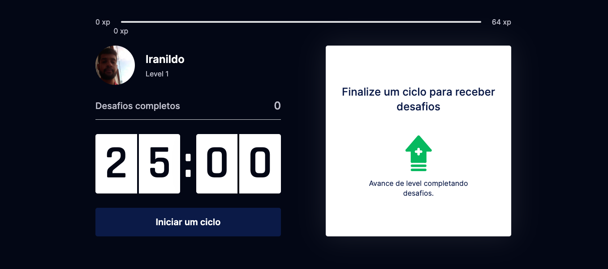
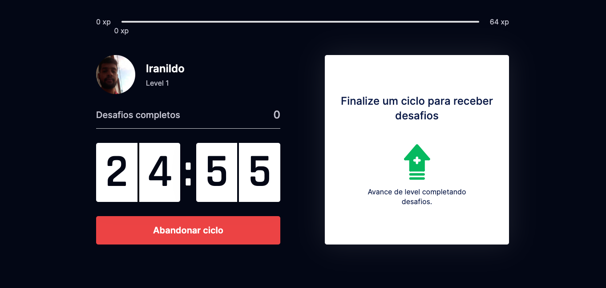
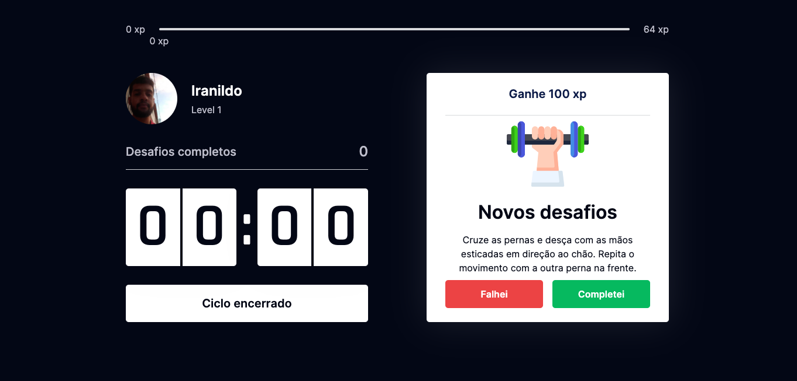
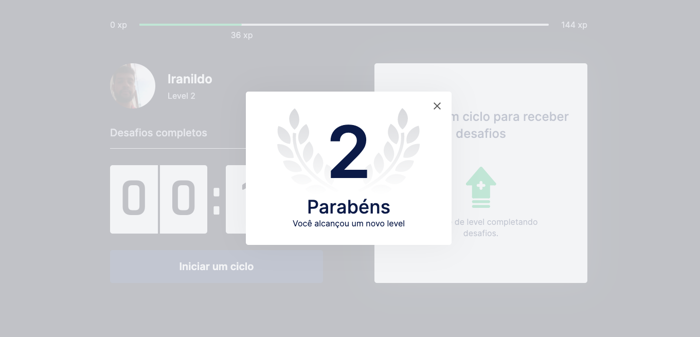

<h1 align="center"> MoveIt
</h1>

<h1 align="center">
    
</h1>

<p align="center">
 <a href="#-sobre-o-projeto">Sobre</a> •
 <a href="#-layout">Layout</a> • 
 <a href="#-como-executar-o-projeto">Como executar</a> • 
 <a href="#-tecnologias">Tecnologias</a> • 
 <a href="#-autor">Autor</a> • 
</p>


## 💻 Sobre o projeto

O moveIt é um projeto desenvolvido durante o evento NLW-04. Trata-se de um cronômetro para utilizar a técnica POMODORO, no final de cada ciclo o usuário recebe um desafio de um exercício. 


---

## 🎨 Layout

### Tela do MoveIt

<p align="center" style="display: flex; align-items: flex-start; justify-content: center;">
  
</p>
<p align="center" style="display: flex; align-items: flex-start; justify-content: center;">
  
</p>
<p align="center" style="display: flex; align-items: flex-start; justify-content: center;">
  
</p>
<p align="center" style="display: flex; align-items: flex-start; justify-content: center;">
  
</p>

---

## 🚀 Como executar o projeto

Este projeto possui uma pasta:

1. Frontend 

### Pré-requisitos

Antes de começar, você vai precisar ter instalado em sua máquina as seguintes ferramentas:
[Git](https://git-scm.com), [Node.js](https://nodejs.org/en/). 
Além disto é bom ter um editor para trabalhar com o código como [VSCode](https://code.visualstudio.com/)

### 🧭 Rodando a aplicação web

```bash

# Clone este repositório
$ git clone github.com/IranildoFs/move_it_projeto_rockeatseat.git

# Acesse a pasta do projeto no seu terminal/cmd
$ cd move_it_projeto_rockeatseat

# Vá para a pasta da aplicação Front End
$ cd ccccccc

# Instale as dependências
$ npm install

# Execute a aplicação em modo de desenvolvimento
$ yarn start 

# A aplicação será aberta na porta:3000 - acesse http://localhost:3000

```

---

## 🛠 Tecnologias

As seguintes ferramentas foram usadas na construção do projeto:

### **Website**  ([React](https://reactjs.org/)  +  [TypeScript](https://www.typescriptlang.org/))

-   **[Next]**
-   **[React]**
-   **[TypeScript]**

## 💪 Como contribuir para o projeto

1. Faça um **fork** do projeto.
2. Crie uma nova branch com as suas alterações: `git checkout -b my-feature`
3. Salve as alterações e crie uma mensagem de commit contando o que você fez: `git commit -m "feature: My new feature"`
4. Envie as suas alterações: `git push origin my-feature`
> Caso tenha alguma dúvida confira este [guia de como contribuir no GitHub](./CONTRIBUTING.md)

---

## 🦸 Autor

Iranildo Fialho da Silva


